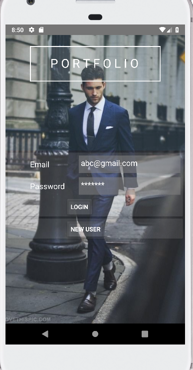
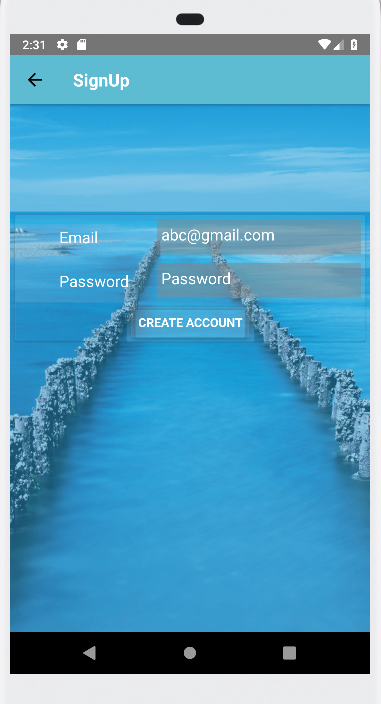
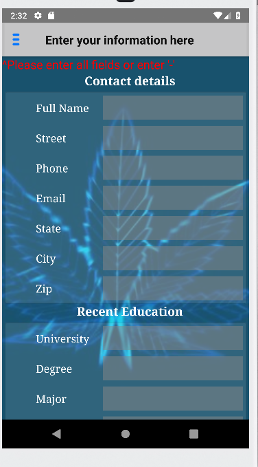
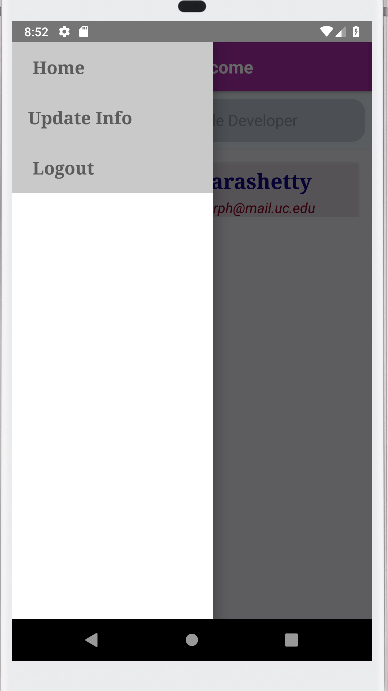
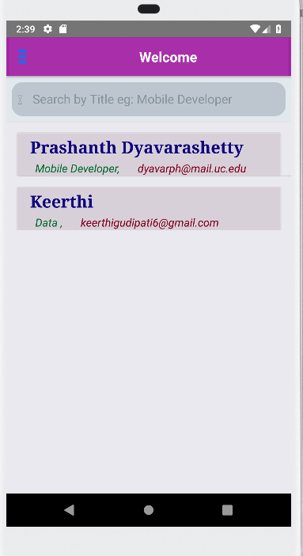
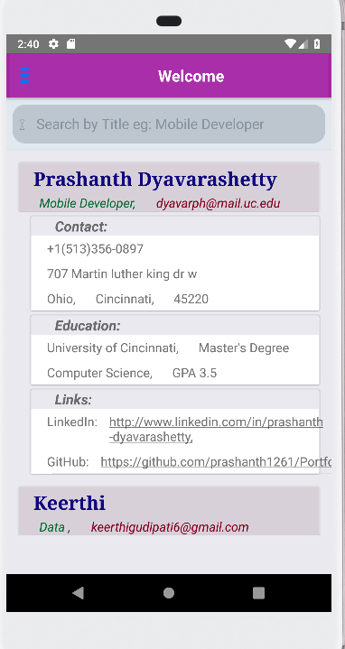
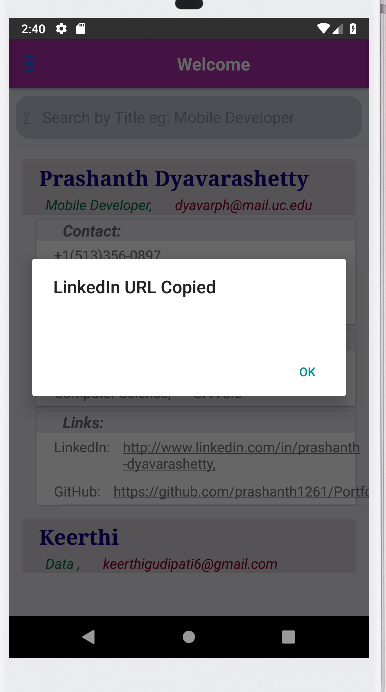

# Portfolio
Portfolio is an Andriod app where user’s data gets projected on the screen and search users by title. Only the authenticated user can update his details, can view the other’s information but can’t update other’s details.

# Tools Used
React Native, Android Studio, ES6, JSX, Firebase, Visual Studio code.

# Screenshots
      

# Installation
<ol>
<li>Node.js</li>
<li>npm install -g react-native-cli</li>    
<li>react-native init projectname project</li>
<li>cd projectname</li> 
<li>react-native start reset cache</li>
<li>react-native run-android</li>
<ol>

# Required dependencies
<ul>
<li>react</li>
<li>react-native</li>
<li>firebase</li>
<li>react-redux</li>
<li>redux</li>
<li>eslint-config-rallycoding</li>
<li>lodash</li>
<li>react-native-elements</li>
<li>react-native-router-flux</li>
<li>redux-thunk</li>
<ul>
